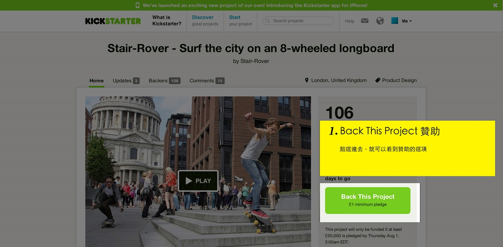
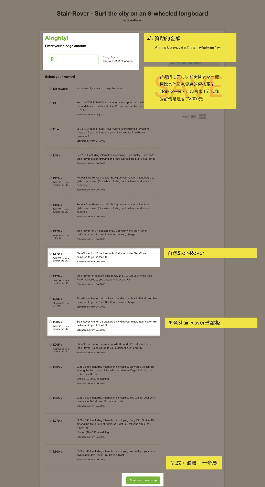
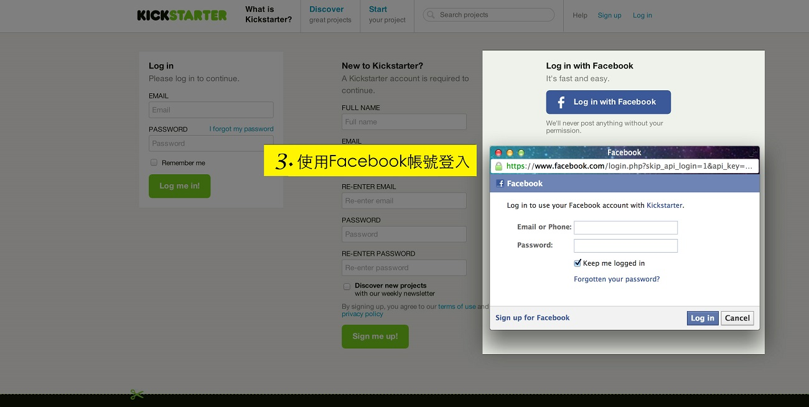
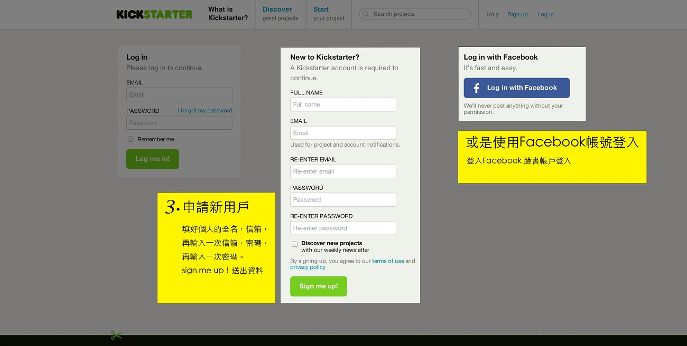
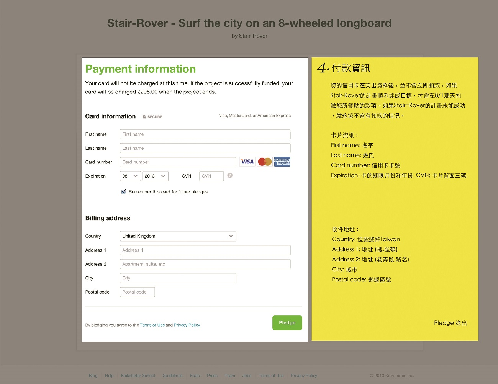
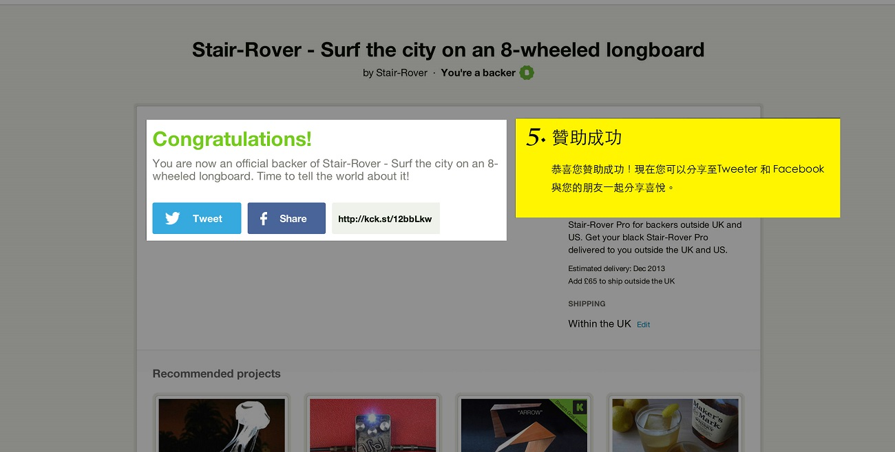

### 如何在Kickstarter上支持Align?

請選擇 [我知道怎麼在Kickstarter贊助計畫](http://kck.st/1i1DhKV) 直接前往頁面，或看我們下面的詳細介紹。

Kickstarter是全世界最大的創意計畫群眾集資平台。你現在就可以上Kickstarter預購你的Align，支持我們的計畫。如果你對於Kickstarter的英文介面不熟悉，我們特別製作了一步一步的教學圖說，讓你一目了然、不用費心，只要按照下列步驟完成贊助手續，你就能成為全世界第一批擁有Align的收藏家！

---

### 第一步 : 在我們的計畫頁面上按下支持按鈕。

### 第二步 : 選擇你所想要的回饋。

### 第三步 : 登入Kickstarter會員，如果尚未成為會員，可以利用Facebook快速登入，或是用電子信箱申請。這個頁面是屬於Kickstarter的平台系統，和嘖嘖的會員登入並不相同。

### 第四步 : 前往付款頁面

謝謝你對Align計畫的支持，希望你能幫助我們將計畫分享給你的朋友！

### [立即前往Kickstarter上的Align計畫頁面](http://kck.st/1i1DhKV)

<iframe width="100%" height="480" src="http://www.kickstarter.com/projects/stair-rover/stair-rover-surf-the-city-with-an-innovative-longb/widget/video.html" frameborder="0"> </iframe>
